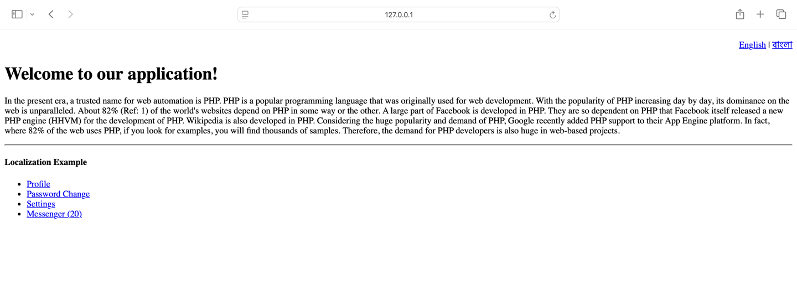
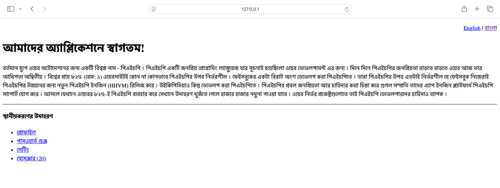

# Laravel 11 Localization Example

An example of creating a Laravel project with localization support for `English` and `Bengali`, allowing users to toggle the language by clicking a button.

### English


### Bengali


For more details about Laravel localization, visit the [official documentation](https://laravel.com/docs/11.x/localization).


## Project Create Guideline

To create a Laravel project with localization support for English and Bangla, and a feature to toggle the language on button click, follow these steps:

---

### 1. **Create a New Laravel Project**
Run the following command to create a new Laravel project:
```bash
composer create-project laravel/laravel laravel-localization
cd laravel-localization
```

---

### 2. **Setup Localization Files**
Localization files are stored in the `resources/lang` directory.

1. Create two subdirectories: `en` and `bn`:
   ```bash
   mkdir -p resources/lang/en resources/lang/bn
   ```

2. Create `messages.php` in both `en` and `bn` folders.

   **`resources/lang/en/messages.php`**:
   ```php
   return [
       'welcome' => 'Welcome to our application!',
   ];
   ```

   **`resources/lang/bn/messages.php`**:
   ```php
   return [
       'welcome' => 'আমাদের অ্যাপ্লিকেশনে স্বাগতম!',
   ];
   ```


### 3. Middleware for Localization
To make localization changes effective throughout the app, create middleware:

```bash
php artisan make:middleware LocalizationMiddleware
```

In `app/Http/Middleware/LocalizationMiddleware.php`:
```php
use Closure;
use Illuminate\Support\Facades\App;
use Illuminate\Support\Facades\Session;

public function handle($request, Closure $next)
{
    $locale = Session::get('locale', 'en');
    App::setLocale($locale);

    return $next($request);
}
```

Register the middleware in `bootstrap/app.php`:
```php
use App\Http\Middleware\LocalizationMiddleware;
use Illuminate\Foundation\Application;
use Illuminate\Foundation\Configuration\Exceptions;
use Illuminate\Foundation\Configuration\Middleware;

return Application::configure(basePath: dirname(__DIR__))
    ->withRouting(
        web: __DIR__.'/../routes/web.php',
        commands: __DIR__.'/../routes/console.php',
        health: '/up',
    )
    ->withMiddleware(function (Middleware $middleware) {
        // Add localization middleware
        $middleware->web(append: LocalizationMiddleware::class);
    })
    ->withExceptions(function (Exceptions $exceptions) {
        //
    })->create();
```

This ensures the locale is set for every request.

---

### 4. **Create a Controller for Language Switching**
Generate a controller:
```bash
php artisan make:controller LanguageController
```

Add the following method in `LanguageController`:

```php
use Illuminate\Support\Facades\Session;

public function switchLang($lang)
{
    if (in_array($lang, ['en', 'bn'])) {
        Session::put('locale', $lang);
    }
    return redirect()->back();
}
```

---

### 5. **Setup Routes**
Add routes for language switching in `routes/web.php`:

```php
use App\Http\Controllers\LanguageController;

Route::get('/switch-lang/{lang}', [LanguageController::class, 'switchLang'])->name('switchLang');
```

---

### 6. **Create a View**
In `resources/views/welcome.blade.php`, add a toggle button:

```html
<!DOCTYPE html>
<html lang="{{ str_replace('_', '-', app()->getLocale()) }}">
<head>
    <meta charset="UTF-8">
    <meta name="viewport" content="width=device-width, initial-scale=1.0">
    <title>Laravel Localization</title>
</head>
<body>
    <h1>{{ __('messages.welcome') }}</h1>
    <a href="{{ route('switchLang', ['lang' => 'en']) }}">English</a> |
    <a href="{{ route('switchLang', ['lang' => 'bn']) }}">বাংলা</a>
</body>
</html>
```

---

### 7. **Test the Application**
1. Run the development server:
   ```bash
   php artisan serve
   ```

2. Visit the application in your browser: [http://localhost:8000](http://localhost:8000).  
   Toggle between English and Bangla by clicking the links.
